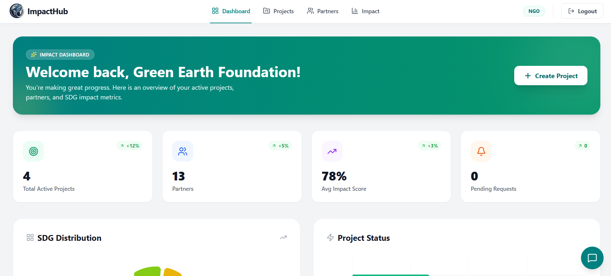
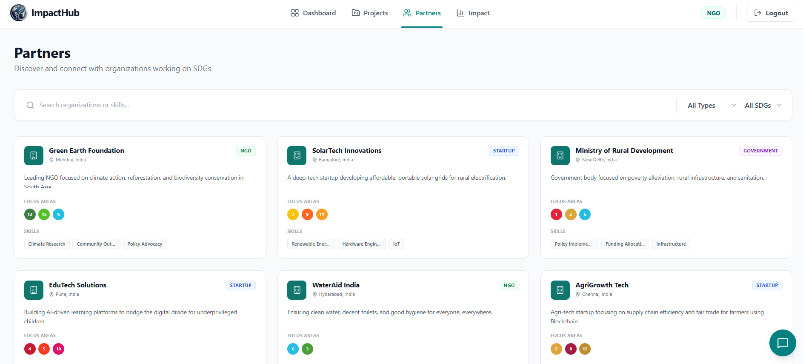
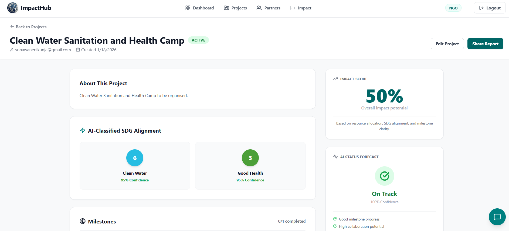
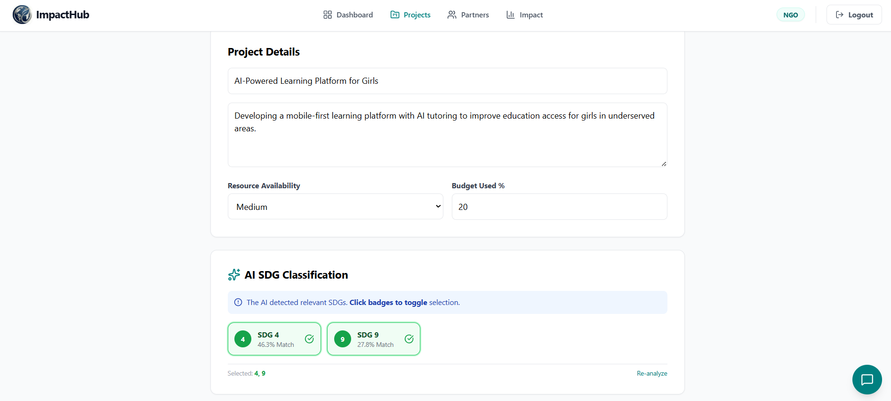

<div align="center">
  

  # 🌍 ImpactHub
  ### AI-Powered SDG Collaboration Ecosystem

  <p>
    <b>Connect. Collaborate. Accelerate.</b><br>
    Bridging the gap between NGOs, Startups, and Governments to achieve the UN Sustainable Development Goals using Artificial Intelligence.
  </p>

  <p>
    <a href="https://reactjs.org/">
      
    </a>
    <a href="https://flask.palletsprojects.com/">
      
    </a>
    <a href="https://scikit-learn.org/">
      
    </a>
    <a href="https://www.mongodb.com/">
      
    </a>
  </p>

  <p>
    <a href="#-deployment-status">Deployment Status</a> •
    <a href="#-ai-architecture-technical-deep-dive">AI Architecture</a> •
    <a href="#-setup--installation">Setup</a>
  </p>
</div>

---

## ⚠️ Prototype Deployment Status

> **Just a quick note regarding our prototype deployment:**
>
> * **Frontend:** Deployed on **Vercel** and fully accessible (includes Firebase authentication).
> * **Backend:** The Flask API with ML models was deployed on **Render**. However, the free-tier instance crashed due to the high memory usage required by the `Sentence-Transformer` and NLP models.
> * **Current State:** The Vercel link below currently demonstrates the **Frontend UI only**.
>
> **Please refer to the Demo Video below for the complete working prototype including full AI/ML functionality.**

| **Platform** | **Link** |
| :--- | :--- |
| 🌐 **Live Frontend** | [**Launch Vercel Deployment**](https://impacthub-rho.vercel.app/) |
| 🎬 **Full Demo Video** | [**Watch on Google Drive**](https://drive.google.com/drive/folders/11RB_WDqFDCZtJaPq2kYAx6tr4hvJE3aE?usp=sharing) |

---

## 📸 Project Interface

| **Smart Dashboard** | **AI Partner Recommendations** |
|:---:|:---:|
|  |  |
| *Real-time analytics & SDG distribution* | *Semantic matching for NGOs & Startups* |

| **Project Details & AI Insights** | **SDG Classification** |
|:---:|:---:|
|  |  |
| *Impact Score & Status Forecast* | *Automated multi-label tagging* |

---

## 🚩 Problem Statement

Organizations working on **Sustainable Development Goals (SDGs)** often operate in silos, leading to:
* **Discovery Gap:** Finding the right collaboration partner takes months of manual searching.
* **Data Fragmentation:** No unified standard exists for tracking SDG alignment across sectors.
* **Predictive Blindness:** Projects frequently fail due to a lack of early warning systems regarding resource allocation and budget risks.

---

## 💡 The Solution

**ImpactHub** is a unified platform that combines **Semantic Search**, **Predictive Analytics**, and **Dynamic Visualizations** to foster smarter collaboration. It replaces manual directories with intelligent, context-aware matching.

### Key Features

| Feature | Description |
| :--- | :--- |
| **🤖 AI Auto-Classification** | Automatically tags projects with relevant SDGs (e.g., "Goal 6: Clean Water") using NLP, ensuring standardized data. |
| **🤝 Smart Partner Matching** | Recommends partners based on **semantic similarity** of skills and past project history, with a "Local-First" prioritization. |
| **🔮 Impact Predictor** | Forecasts if a project is **"On Track"** or **"At Risk"** based on milestones, budget utilization, and team size. |
| **📊 Interactive Dashboards** | Visualizes global SDG efforts vs. individual organization performance using dynamic charts. |

---

## 🧠 AI Architecture: Technical Deep Dive

The platform is powered by three distinct machine learning pipelines. Below is the technical breakdown of each model.

### 1️⃣ SDG Classification Pipeline (NLP)
**Goal:** Automatically classify project descriptions into one or more of the 17 UN SDGs.
* **Notebook:** [View Colab Notebook](https://colab.research.google.com/drive/1TpeGCsX8JCaqv9L_Sq32mJjiU3PZkt2D?usp=sharing)

**Implementation Steps:**
1.  **Data Acquisition:** Utilized the **OSDG Community Dataset** (Zenodo), filtering for high-confidence labels (`agreement score > 0.6`) to reduce noise.
2.  **Feature Extraction:** Implemented **TF-IDF Vectorization** (`ngram_range=(1,2)`, `max_features=20000`) to capture both unigrams and bigrams, modeling short phrases and token context effectively.
3.  **Model Selection:** Trained a **Logistic Regression** classifier (`solver='liblinear'`) which is ideal for high-dimensional, sparse text data.
4.  **Inference:** The model accepts raw project text, vectorizes it, and returns the predicted SDG along with a confidence score.
5.  **Persistence:** The vectorizer and classifier are serialized via `pickle` for instant deployment.

### 2️⃣ Partner Recommendation Engine
**Goal:** Recommend collaboration partners based on semantic alignment of project goals.
* **Notebook:** [View Colab Notebook](https://colab.research.google.com/drive/1JHm6sZUu4SQWabV7yF-5ix91HgJbu7FV?usp=sharing)

**Implementation Steps:**
1.  **Active-Project Filtering:** The pipeline filters for active projects (`End Date >= Today`) to ensure relevance.
2.  **Semantic Embedding:** We aggregate project metadata (Title, Description, Entity Type) and encode it using a pre-trained **SentenceTransformer** (`all-MiniLM-L6-v2`). This creates dense 384-dimensional vectors representing the *semantic meaning* of a project.
3.  **Similarity Scoring:** User queries are encoded into the same vector space. We calculate **Cosine Similarity** between the user query and all database vectors.
4.  **Localization Logic:** A custom re-ranking layer prioritizes partners based in **India** using regex metadata checks, presenting "Local Matches" alongside "Global Matches".
5.  **Output:** Returns a ranked list of partners with a percentage match score (e.g., "92% Match").

### 3️⃣ Impact Prediction Model
**Goal:** Forecast project health status ("On Track" vs "At Risk") using structured operational data.

**Implementation Steps:**
1.  **Feature Engineering:** Constructed a dataset with features including:
    * `Budget_Used_Percentage`
    * `Milestones_Completed_Percentage`
    * `Resource_Availability` (Categorical: Low/Medium/High)
    * `Team_Size`
2.  **Model Training:** Trained a **Random Forest Classifier** to learn non-linear relationships between resource utilization and project success.
3.  **Inference:** The model takes real-time dashboard inputs and predicts the probability of project success, displayed as an "Impact Score" (0-100%).

---

## 🛠 Tech Stack

| Component | Technologies Used |
| :--- | :--- |
| **Frontend** | React.js, Tailwind CSS, Lucide Icons, Recharts, Firebase Auth |
| **Backend** | Python, Flask, PyMongo, RESTful API |
| **AI / ML** | Scikit-Learn, Pandas, Sentence-Transformers, NumPy, Pickle |
| **Database** | MongoDB Atlas (Cloud NoSQL) |
| **DevOps** | Vercel (Frontend), Render (Backend) |

---

## 🚀 Setup & Installation

Follow these steps to run the full stack locally.

### 1. Clone the Repository
```bash
git clone [https://github.com/Nikunja0611/HM099_CodeBuzzers.git](https://github.com/Nikunja0611/HM099_CodeBuzzers.git)
cd impacthub

```

### 2. Backend Setup

```bash
cd backend
python -m venv venv
# Activate Virtual Env:
# Windows: venv\Scripts\activate
# Mac/Linux: source venv/bin/activate

pip install -r requirements.txt

# (Optional) Seed the database with demo data
python seed_db.py

# Start the Flask Server
python app.py

```

> Backend runs on `http://localhost:5000`

### 3. Frontend Setup

```bash
cd frontend
npm install

# Start the React App
npm start

```

> Frontend runs on `http://localhost:3000`

---

## 📜 License

This project was developed for the **HackMait 2024** Hackathon.

```

```